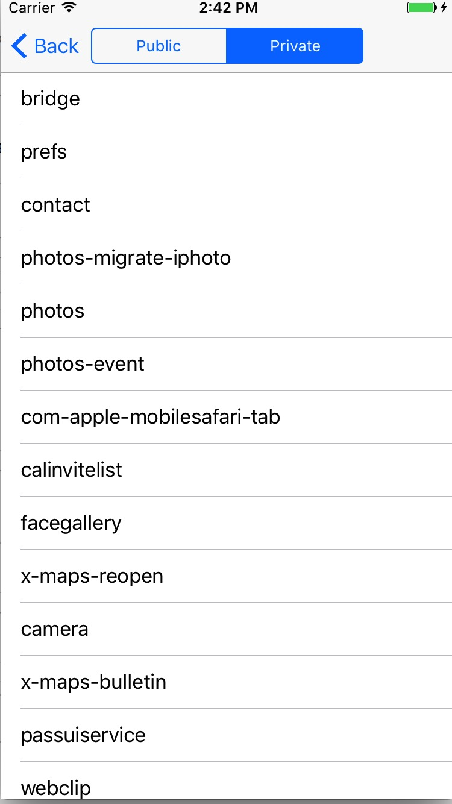

# AppInfo
AppInfo

###项目简介
使用私有API显示安装的所有app的基本信息
参考的私有API参考[PrivateHender](AppInfo/PrivateHender) 

* [LSApplicationProxy](AppInfo/PrivateHender/LSApplicationProxy.h)
* [LSApplicationWorkspace](AppInfo/PrivateHender/LSApplicationWorkspace.h)
* [UIImage](AppInfo/PrivateHender/UIImage.h)

###预览

|  | |
| ------------- |:-------------:| 
| |  |

